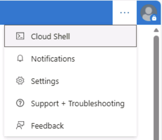

---
lab:
    index: 00
    title: Azure Databricks 환경 설정
    module: Azure Databricks 환경 설정
    description: Azure Cloud Shell을 사용하여 Azure 구독에 Azure Databricks Premium 작업 영역을 프로비저닝합니다.
    duration: 15 minutes
    level: 100
    islab: false
---
---
|구분|내용|
|---|---|
|설명| 이 설정 랩은 Azure Cloud Shell을 사용하여 Azure 구독에 Azure Databricks Premium 작업 영역을 프로비저닝하는 방법을 안내합니다.| 
|소요시간| 15분|
|난이도| 100|
---

# Azure Databricks 환경 설정

이 과정의 랩을 시작하기 전에 **Azure Databricks Premium 작업 영역**을 프로비저닝해야 합니다. 이 설정 랩은 로컬에 도구를 설치할 필요 없이 **Azure Cloud Shell**을 사용하여 해당 과정을 안내합니다.

이 설정은 완료하는 데 약 **15분**이 소요됩니다.

---

## Azure Databricks Premium 작업 영역 프로비저닝

하나의 Azure CLI 스크립트를 Cloud Shell에서 실행하여 리소스 그룹과 무작위로 선택된 Azure 지역에 Azure Databricks Premium 작업 영역을 생성합니다.

### 작업 1: Azure Cloud Shell 열기

1. 제공된 자격 증명을 사용하여 `https://portal.azure.com`의 Azure 포털에 로그인합니다.

2. 포털 상단 도구 모음에서 **Cloud Shell** 버튼(>_)을 선택합니다. 메시지가 표시되면 셸 유형으로 **Bash**를 선택하세요.

    > [!NOTE]
    > Cloud Shell 버튼이 보이지 않으면 브라우저 창이 너무 좁을 수 있습니다. 창을 확장하거나 직접 `https://shell.azure.com`으로 이동하여 Cloud Shell을 전체 탭에서 열어보세요.
    > 
    > 
    
3. Cloud Shell을 처음 사용하는 경우 스토리지 계정 설정을 요청받습니다. `No storage account required`를 선택하고, 구독을 선택한 다음 **Apply**를 선택하세요.

4. Cloud Shell 프롬프트가 나타날 때까지 기다립니다. 프롬프트는 다음과 같습니다:

    ```
    yourname@Azure:~$
    ```

### 작업 2: 프로비저닝 스크립트 실행

1. Cloud Shell에서 다음 명령을 실행하여 설정 스크립트를 다운로드하고 실행합니다:

    ```bash
    curl -sL https://raw.githubusercontent.com/asddai/AzureDatabricks202606/main/Labs/00-setup.sh | bash
    ```

2. 배포가 완료될 때까지 기다립니다. 이 작업은 약 **5분** 정도 소요됩니다.

> [!NOTE]
> 지원되는 공개 Azure 리전 목록에서 무작위로 리전이 선택됩니다. 나중 랩에서 쉽게 찾을 수 있도록 작업 영역 이름과 리소스 그룹 이름은 고정되어 있습니다.

### 작업 3: Azure Databricks 작업 영역 열기

1. Azure 포털 상단 검색 창에서 **Azure Databricks**를 검색하여 선택합니다.

2. 목록에서 **rg-adb-2026** 작업 영역을 선택합니다.

3. 작업 영역 개요 페이지에서 **Launch workspace**를 선택합니다. Azure Databricks UI가 새 브라우저 탭에서 열립니다.

4. Azure Databricks 홈 페이지가 표시되는지 확인합니다. 이제 코스 랩을 시작할 준비가 되었습니다.

> [!IMPORTANT]
> **rg-adb-2026** 리소스 그룹 이름을 기록해 두세요. 코스 종료 후 리소스를 정리하려면 해당 이름이 필요합니다.