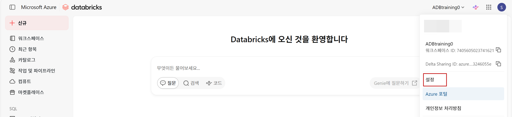
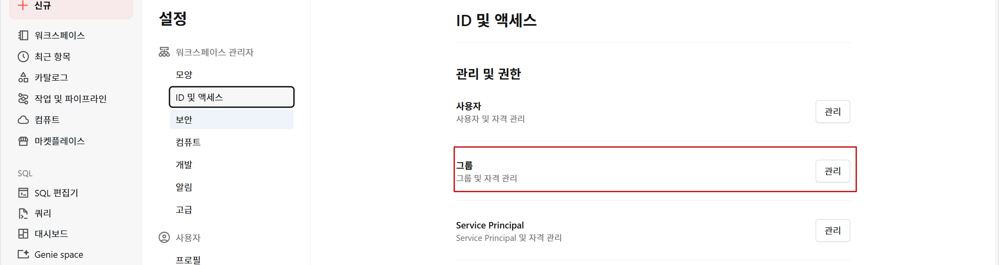
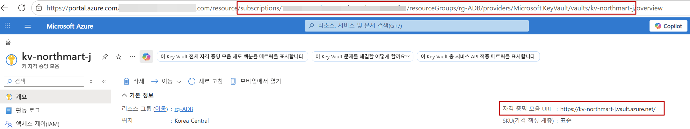
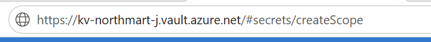
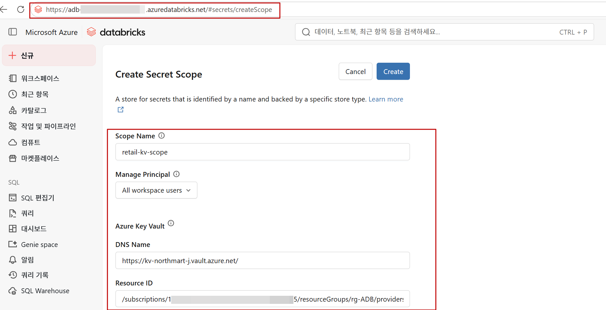

---
lab:
  index: 04
  title: Unity Catalog 개체 보안
  module: Unity Catalog 개체 보안
  module-url: https://learn.microsoft.com/training/wwl-databricks/secure-unity-catalog-objects/
  notebook: https://github.com/asddai/AzureDatabricks/blob/main/Labs/Notebooks/04-secure-unity-catalog-objects-KO.ipynb
  description: 이 랩에서는 Databricks 그룹에 세분화된 액세스 제어를 부여하여 Azure Databricks의 Unity Catalog 개체를 보호하고, 행 필터를 적용하여 고객 데이터를 지역별로 제한하며, 열 마스크 함수를 사용하여 PII 이메일 주소를 마스킹합니다. 또한 Azure Key Vault 지원 비밀 범위를 생성하고 노트북 내에서 안전하게 비밀을 검색하므로 민감한 자격 증명이 코드에 노출되지 않습니다.
  duration: 50분
  level: 300
  islab: true
  primarytopics:
    - Azure Databricks
---

---
|구분|내용|
|---|---|
|설명| 이 랩에서는 Databricks 그룹에 세분화된 액세스 제어를 부여하여 Azure Databricks의 Unity Catalog 개체를 보호하고, 행 필터를 적용하여 고객 데이터를 지역별로 제한하며, 열 마스크 함수를 사용하여 PII 이메일 주소를 마스킹합니다. 또한 Azure Key Vault 지원 비밀 범위를 생성하고 노트북 내에서 안전하게 비밀을 검색하므로 민감한 자격 증명이 코드에 노출되지 않습니다|
|소요시간| 50분|
|난이도| 300|
---

# 랩 04: Unity Catalog 개체 보안

## 시나리오

귀사는 북부, 남부, 동부 및 서부 지역 4곳에서 운영되는 전국 슈퍼마켓 체인인 **NorthMart Retail**의 데이터 엔지니어입니다. 귀사의 팀은 Azure Databricks의 중앙 집중식 데이터 플랫폼을 관리하며, 여기에는 고객 데이터, 충성도 프로그램 기록 및 지역별 판매 거래가 포함되어 있습니다.

보안 팀에서 여러 가지 우려 사항을 제기했습니다:

- 지역 분석가는 자신의 지역 데이터만 볼 수 있어야 합니다 — 다른 지역의 고객 기록은 볼 수 없습니다.
- 고객 이메일 주소는 개인식별정보(PII)이며 대부분의 사용자에게 마스킹되어야 합니다.
- 타사 충성도 플랫폼은 통합을 위해 API 키가 필요합니다 — 해당 키는 노트북이나 코드에 저장되면 안 됩니다.

이 랩에서는 Azure Databricks Unity Catalog에서 **액세스 제어**, **행 필터링**, **열 마스킹** 및 **Azure Key Vault 지원 비밀**을 구현하여 이 세 가지 우려 사항을 모두 해결합니다.

## 목표

이 랩을 완료하면 다음을 수행할 수 있습니다:

- SQL을 사용하여 Databricks 그룹에 스키마 수준 권한을 부여하고 확인합니다.
- 행 필터 함수를 적용하여 지역별 고객 기록을 제한합니다.
- 열 마스크를 적용하여 PII 이메일 데이터를 보호합니다.
- Azure Key Vault를 생성하고 비밀을 저장합니다.
- Azure Databricks에서 Key Vault 지원 비밀 범위를 생성합니다.
- 노트북 내에서 안전하게 비밀을 검색합니다.

이 랩은 완료하는 데 약 **50분**이 소요됩니다.

---

## 🤖 이 랩 전체에서 Genie Code를 사용합니다

이 랩 중에는 항상 **Genie Code**를 사용할 것을 **강력히 권장합니다**. 노트북의 모든 연습 셀에는 Genie Code 패널에 직접 붙여넣을 수 있는 제안 프롬프트가 포함되어 있습니다.

Genie Code를 열려면 모든 노트북 셀 오른쪽에 있는 을 선택하거나 도구 모음에 표시된 키보드 단축키를 누릅니다.

> 💡 **팁:** Genie Code의 출력을 무조건 복사하여 붙여넣지 마세요. 읽고 이해한 다음 작업 요구 사항에 맞게 조정하세요. Genie Code는 사고를 대체하지 않고 가속화하는 도구입니다.

---

## 필수 조건

이 랩을 시작하기 전에 다음을 확인하세요:

- [랩 00: Azure Databricks 환경 설정](00-setup.md)을 사용하여 프로비저닝된 **Azure Databricks Premium 작업 영역**이 있습니다.
- 작업 영역에 연결된 활성 **Unity Catalog 메타스토어**가 있습니다.
- 메타스토어에 **CREATE CATALOG** 권한이 있습니다.
- Key Vault를 생성할 수 있는 **Azure 구독**이 있습니다.
- 기본 SQL에 익숙합니다(CREATE TABLE, SELECT, GRANT).

---

## 랩 노트북 가져오기

1. Azure Databricks 작업 영역에서 왼쪽 사이드바의 **작업 영역**을 선택합니다.
2. 이 랩을 저장할 폴더로 이동하거나 생성합니다.
3. 폴더 옆의 **⋮**(kebab) 메뉴를 선택한 다음 **가져오기**를 선택합니다.
4. **URL**을 선택하고 다음 URL을 입력한 다음 **가져오기**를 선택합니다:
   `https://github.com/asddai/AzureDatabricks/blob/main/Labs/Notebooks/04-secure-unity-catalog-objects-KO.ipynb`
5. 가져온 노트북을 열고 위쪽의 컴퓨팅 선택기에서 **서버리스** 컴퓨팅을 선택합니다.

---

## 노트북을 열기 전에: Databricks 그룹 생성

연습 1에서 Databricks 그룹에 권한을 부여합니다. 그 연습에 도달할 때 준비되도록 지금 그룹을 생성하세요.

1. Databricks 작업 영역에서 **사용자별 이름**(오른쪽 위) → **설정**을 선택합니다.
 

2. **ID 및 액세스** → **그룹** → **관리** 선택 → **그룹 추가**로 이동합니다.

3. 그룹 이름을 `retail-analysts`로 지정하고 **저장**을 선택합니다.
4. 그룹이 생성되면 자신의 사용자 계정을 구성원으로 추가합니다.

> ℹ️ 이 그룹은 NorthMart Retail의 지역 분석가 팀을 나타냅니다. 연습 1에서 이 그룹에 실습 스키마에 대한 액세스 권한을 부여합니다.

---

## 연습 4 전: Azure Key Vault 생성

연습 4에는 사전 생성된 비밀이 있는 Azure Key Vault가 필요합니다. 노트북에서 연습 4에 도달하기 전에 이 단계를 Azure Portal에서 완료하거나 병렬로 준비하세요.

### 단계 1: Key Vault 생성

1. [Azure Portal](https://portal.azure.com)을 열고 **리소스 만들기**를 선택합니다.
2. **Key Vault**를 검색하고 **만들기**를 선택합니다.
3. Key Vault를 구성합니다:
   - **리소스 그룹**: 랩 리소스 그룹을 사용합니다.
   - **Key Vault 이름**: `kv-northmart-<귀사의-이니셜>`(전역적으로 고유해야 함).
   - **지역**: Databricks 작업 영역과 동일한 지역입니다.
   - **가격 책정 계층**: 표준입니다.
4. **액세스 구성** 탭에서 **권한 모델**을 **자격 증명 모음 액세스 정책**으로 설정합니다.
5. **검토 + 만들기**를 선택한 다음 **만들기**를 선택합니다.

### 단계 2: 사용자에 대한 액세스 정책 추가

1. Key Vault가 배포되면 포털에서 엽니다.
2. **액세스 정책** → **만들기**를 선택합니다.
3. **비밀 권한** 아래에서 **가져오기** 및 **목록**을 선택합니다.
4. **주체** 아래에서 자신의 Azure 사용자 계정을 검색하고 선택합니다.
5. **만들기**를 선택하여 정책을 저장합니다.
   (자신의 Azure 사용자 계정이 추가되어있는 경우 이 단계는 건너뛸 수 있습니다.)


### 단계 3: 비밀 추가

1. Key Vault에서 왼쪽 블레이드 **개체** →  **비밀** → **생성/가져오기**를 선택합니다.
2. 다음을 설정합니다:
   - **이름**: `loyalty-api-key`
   - **값**: `NORTHMART-LOYALTY-2026-SECURE`
3. **만들기**를 선택합니다.

### 단계 4: Key Vault 세부 정보 기록

Key Vault를 떠나기 전에 **개요**로 이동하고 다음을 복사합니다:
- **자격 증명 모음 URI**(DNS 이름), 예: *https://kv-northmart-abc.vault.azure.net/*
- **리소스 ID**, 예: */subscriptions/xxxxxxxx/resourceGroups/rg-lab/providers/Microsoft.KeyVault/vaults/kv-northmart-abc*


연습 4에서 Databricks 비밀 범위를 생성할 때 두 값 모두 필요합니다.

### 단계 5: Databricks 비밀 범위 생성

1. 브라우저에서 다음으로 이동합니다:

    ```
    https://<귀사의-databricks-작업-영역-url>#secrets/createScope
    ```
   
    > ⚠️ **createScope**의 **S**는 대문자여야 합니다. `<귀사의-databricks-작업-영역-url>`을 실제 작업 영역 URL로 바꿉니다(뒤에 '/' 제거).

2. 범위를 구성합니다:
   - **범위 이름**: `retail-kv-scope`
   - **주체 관리**: `모든 작업 영역 사용자`
   - **DNS 이름**: 단계 4의 자격 증명 모음 URI를 붙여넣습니다.
   - **리소스 ID**: 단계 4의 리소스 ID를 붙여넣습니다.
3. **만들기**를 선택합니다.

> ✅ **예상 결과:** 범위가 생성되었음을 나타내는 확인 메시지가 표시되어야 합니다. 범위는 이제 Azure Key Vault와 연결되며, 여기에 추가하는 모든 비밀은 Databricks 노트북에서 액세스할 수 있습니다.

---

이제 노트북을 열고 연습을 완료할 준비가 되었습니다.
