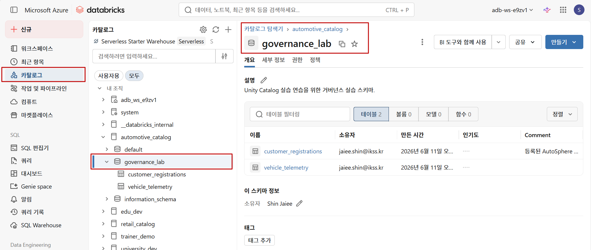
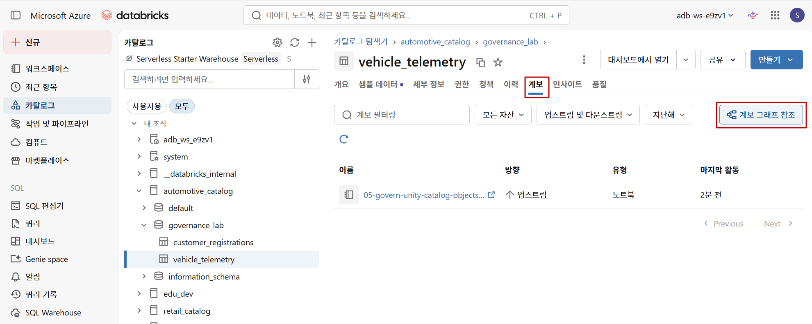

---
lab:
  index: 05
  title: Unity Catalog 개체 관리
---

---
|구분|내용|
|---|---|
|설명| 이 랩에서는 Azure Databricks에 구축된 커넥티드 차량 데이터 플랫폼에 Unity Catalog 거버넌스 제어를 적용합니다. SQL을 사용하여 테이블 및 열에 PII 분류를 위해 태그를 지정하고, Delta Lake 보존 정책을 구성하고 VACUUM을 실행하여 삭제된 데이터를 제거하며, 예측 최적화를 사용하도록 설정합니다. 그런 다음 시스템 테이블을 쿼리하여 데이터 계보를 프로그래밍 방식으로 추적하고 감사 로그를 분석하여 누가 데이터에 액세스했는지, 언제 액세스했는지에 대한 규정 준수 질문에 답합니다.|
|소요시간| 50분|
|난이도| 300|
---

# 랩 05: Unity Catalog 개체 관리

## 시나리오

귀사는 Azure Databricks에 커넥티드 차량 데이터 플랫폼을 구축하는 글로벌 자동차 제조업체인 **AutoSphere AG**의 데이터 엔지니어입니다. 이 플랫폼은 수백만 대의 차량에서 원격 측정을 수집하고, 고객 및 차량 등록 데이터를 관리하며, 서비스 기록을 추적합니다.

데이터 거버넌스 팀에서 다음과 같은 우려 사항을 제기했습니다:

- 차량 원격 측정 데이터에는 적극적인 쓰기 패턴이 있으며 저장소 증가를 제어하고 GDPR 데이터 최소화 요구 사항을 준수하기 위해 **보존 정책**을 잘 정의해야 합니다.
- 데이터 팀은 테이블이 파생되는 방식을 이해하고 업스트림 변경의 영향을 추적하기 위해 **전체 계보 가시성**이 필요합니다.
- 규정 준수 팀은 수동 로그 검색이 아닌 쿼리 가능한 로그를 사용하여 **누가 어떤 데이터에 액세스했는지, 언제 액세스했는지 감사**해야 합니다.

이 랩에서는 Azure Databricks Unity Catalog에서 태깅, 보존 정책, 계보 쿼리 및 감사 로그 분석을 적용하여 이러한 모든 우려 사항을 해결합니다.

---

## 목표

이 랩을 완료하면 다음을 수행할 수 있습니다:

- 데이터 검색을 위해 테이블 및 열에 설명 주석 및 태그를 적용합니다.
- Delta Lake 보존 설정을 구성하고 VACUUM 작업을 실행합니다.
- 카탈로그 탐색기에서 시각적으로 데이터 계보를 봅니다.
- 계보 시스템 테이블을 프로그래밍 방식으로 쿼리합니다.
- 감사 로그 시스템 테이블을 쿼리하여 데이터 액세스 패턴을 조사합니다.

이 랩은 완료하는 데 약 **50분**이 소요됩니다.

---

## 🤖 이 랩 전체에서 Genie Code를 사용합니다

이 랩 중에는 항상 **Genie Code를 사용**할 것을 **강력히 권장합니다**. 노트북의 모든 연습 셀에는 Genie Code 패널에 직접 붙여넣을 수 있는 제안 프롬프트가 포함되어 있습니다.

Genie Code를 열려면 모든 노트북 셀 오른쪽에 있는 을 선택하거나 도구 모음에 표시된 키보드 단축키를 누릅니다.

> 💡 **팁:** Genie Code의 출력을 무조건 복사하여 붙여넣지 마세요. 읽고 이해한 다음 현재 작업에 맞게 조정하세요. Genie Code는 사고를 대체하지 않고 가속화하는 도구입니다.

---

## 필수 조건

이 랩을 시작하기 전에 다음을 확인하세요:

- [랩 00: Azure Databricks 환경 설정](00-setup.md)을 사용하여 프로비저닝된 **Azure Databricks Premium 작업 영역**이 있습니다.
- 작업 영역에 연결된 활성 **Unity Catalog 메타스토어**가 있습니다.
- 메타스토어에 **CREATE CATALOG** 권한이 있습니다.
- 기본 SQL에 익숙합니다(CREATE TABLE, SELECT, ALTER TABLE).

---

## 랩 노트북 가져오기

1. Azure Databricks 작업 영역에서 왼쪽 사이드바의 **작업 영역**을 선택합니다.
2. 이 랩을 저장할 폴더로 이동하거나 생성합니다.
3. 폴더 옆의 **⋮** 메뉴를 선택한 다음 **가져오기**를 선택합니다.
4. **URL**을 선택하고 다음 URL을 입력한 다음 **가져오기**를 선택합니다:
```
https://github.com/asddai/AzureDatabricks/blob/main/Labs/Notebooks/05-govern-unity-catalog-objects-KO.ipynb
```

5. 가져온 노트북을 열고 위쪽의 컴퓨팅 선택기에서 **서버리스** 컴퓨팅을 선택합니다.

---

## 노트북을 열기 전에: 카탈로그 탐색기에서 데이터 계보 보기

노트북에서 연습 1을 완료한 후(테이블 생성) 여기로 돌아와 다음 단계를 따라 **카탈로그 탐색기**에서 계보를 시각적으로 살펴보세요. 이것은 UI 작업이며 노트북 코드가 필요하지 않습니다.

> ⚠️ 먼저 노트북에서 연습 1을 완료한 다음 여기로 돌아오세요.

### 테이블 계보 보기

1. Azure Databricks 작업 영역에서 왼쪽 사이드바의 **카탈로그**를 선택하여 카탈로그 탐색기를 엽니다.
2. **automotive_catalog** > **governance_lab**으로 이동합니다.
     
3. **vehicle_telemetry** 테이블을 선택합니다.
4. **계보** 탭을 선택합니다.
     
5. **계보 그래프 참조**를 선택하여 대화형 계보 시각화를 엽니다.

업스트림 및 다운스트림 관계를 확인합니다. 그래프가 다음을 표시하는지 확인합니다:
- 어느 노트북 또는 작업이 테이블에 기록했는지
- 어느 다운스트림 테이블 또는 뷰가 이에 의존하는지

### 열 수준 계보 보기

1. 여전히 **계보** 탭에서 **service_records** 테이블 노드를 선택합니다.
2. 열(예: **vehicle_id**)을 선택하여 어느 업스트림 열로 추적되는지 살펴봅니다.

### 테이블 기록 보기

1. 카탈로그 탐색기에서 **vehicle_telemetry** 테이블로 이동합니다.
2. **이력** 탭을 선택합니다.
3. 버전 기록을 관찰합니다 — 각 행은 하나의 작업(쓰기, 업데이트, VACUUM 등)을 나타냅니다.

이 기록은 누가 테이블을 수정했는지, 언제 수정했는지 이해하기 위한 감사 추적으로 사용될 수 있습니다.

---

> 카탈로그 탐색기에서 계보 탐색을 마친 후 노트북의 나머지 연습을 진행합니다.
