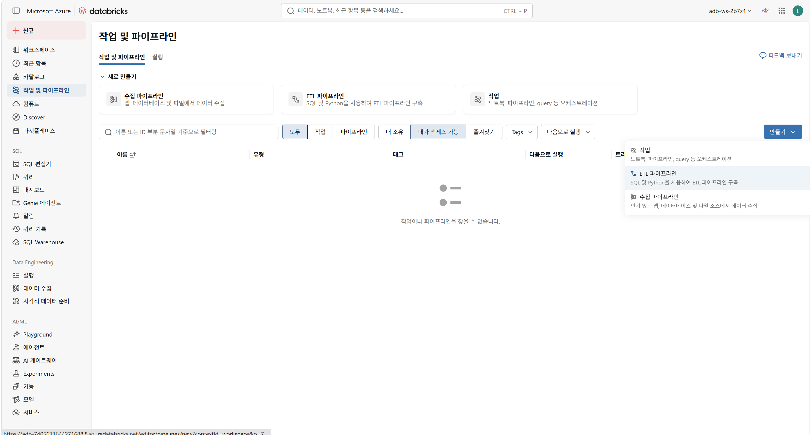
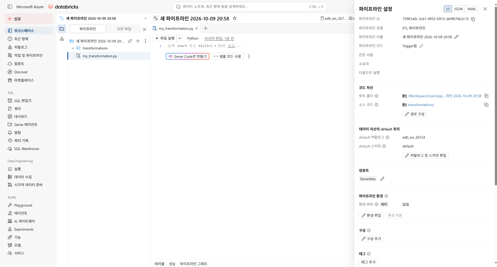

---
lab:
  index: 07
  title: Unity Catalog에 데이터 수집
---

---
|구분|내용|
|---|---|
|설명| 이 랩에서는 Azure Databricks에서 사용 가능한 핵심 데이터 수집 기술을 연습합니다. PySpark DataFrames, SQL COPY INTO 및 CREATE TABLE AS SELECT를 사용하여 Unity Catalog 관리 볼륨에서 CSV 파일을 Delta 테이블로 로드합니다. 또한 Auto Loader를 구성하여 클라우드 저장소에서 새 파일을 자동으로 감지하고 처리하여 지속적으로 도착하는 데이터에 대한 정확히 한 번의 수집을 시연합니다.|
|소요시간| 50분|
|난이도| 300|
---

# 랩 07: Unity Catalog에 데이터 수집

## 시나리오

귀하는 스페인과 독일의 태양광 발전소, 네덜란드와 덴마크의 풍력 터빈 설치를 운영하는 재생 에너지 회사인 **Solaris Energy**의 데이터 엔지니어입니다. 귀사의 팀은 Azure Databricks에 중앙 집중식 데이터 플랫폼을 구축하여 모든 사이트에서 에너지 생산 판독값, 터빈 유지 관리 이벤트 및 그리드 원격 측정을 통합하고 있습니다.

이 랩에서는 Azure Databricks에서 사용 가능한 핵심 데이터 수집 기술을 연습합니다: PySpark DataFrames를 사용한 배치 수집, **COPY INTO** 를 사용한 SQL 기반 파일 로드, **CTAS** 를 사용한 집계 테이블 생성, **Auto Loader** 를 사용한 연속 파일 감지

이 랩을 완료하면 다음을 수행할 수 있습니다:

- 수집된 데이터를 저장할 Unity Catalog 계층(카탈로그, 스키마, 볼륨) 생성
- PySpark DataFrames를 사용하여 관리 볼륨의 CSV 데이터를 Delta 테이블로 로드
- COPY INTO를 사용하여 중복 제거 기능이 포함된 증분 파일 로드
- CREATE TABLE AS SELECT를 사용하여 요약 테이블 생성
- 클라우드 스토리지의 신규 파일을 자동으로 감지하고 처리하도록 Auto Loader 구성

---

## 🤖 Genie Code — 이 랩 전체에서 사용하세요!

모든 연습에 **Genie Code** 를 사용할 것을 권장합니다. Genie Code는 노트북 셀 도구 모음에서 직접 사용할 수 있습니다. 이를 사용하여:

- SQL 및 PySpark 작업에 대한 구문 조회
- 오류 메시지 설명
- 그 다음 조정할 상용구 코드 생성
- 작동 방식에 대한 후속 질문 요청

Genie Code를 열려면 모든 노트북 셀 오른쪽에 있는 을 선택하거나 키보드 단축키를 사용합니다.

💡 **각 연습 셀에는 Genie Code에 직접 복사할 수 있는 제안 프롬프트가 포함되어 있습니다.**

---

## 필수 조건

- [랩 00: Azure Databricks 환경 설정](00-setup.md)을 사용하여 프로비저닝된 **Azure Databricks Premium 작업 영역**이 있습니다.
- 카탈로그 및 볼륨을 생성할 수 있는 권한이 있는 작업 영역에서 **데이터 엔지니어** 역할 이상이 있습니다.
- SQL 및 Python에 대한 기본 이해가 있습니다.

---

## 노트북 외 탐색: Lakeflow Spark 선언형 파이프라인(선택 사항)
Lakeflow Spark 선언적 파이프라인(이전 Delta Live Tables)은 자동 오케스트레이션, 스키마 관리 및 정확한 한 번 처리 보장을 통해 프로덕션 수준의 데이터 수집 파이프라인을 구축하는 데 권장되는 방법입니다.

파이프라인 편집기 탐색:

1. 사이드바에서 **작업 및 파이프라인** 을 선택합니다.
2. **만들기**, **ETL 파이프라인** 을 차례로 선택합니다.
  
3. 소스 노트북 또는 SQL 파일 지정, 파이프라인 카탈로그 및 스키마 이름 지정, 클러스터 유형 선택 등의 옵션을 검토합니다.
  
4. **취소** 를 클릭합니다. 파이프라인을 생성하거나 실행할 필요는 없습니다.

---

## 노트북 가져오기

다음 단계를 따라 랩 노트북을 Databricks 작업 영역으로 가져옵니다:

1. Databricks 작업 영역에서 왼쪽 사이드바의 **작업 영역** 을 클릭합니다.
2. 랩을 저장할 폴더로 이동하거나 생성합니다(예: /Users/<귀사의-이메일>/Labs).
3. **⋮**(kebab) 메뉴를 클릭하거나 폴더를 마우스 오른쪽 단추로 클릭한 다음 **가져오기** 를 선택합니다.
4. **URL** 을 선택하고 다음 URL을 입력한 다음 **가져오기** 를 클릭합니다:
   
   ```
   https://github.com/aiasdd/DP750/blob/main/Labs/Notebooks/07-ingest-data-into-unity-catalog-KO.ipynb
   ```
    
5. 가져온 노트북을 열고 위쪽의 컴퓨팅 선택기에서 **서버리스** 컴퓨팅을 선택합니다.

---

## 랩 개요

노트북은 네 개의 연습으로 구조화되어 있습니다:

| 연습 | 주제 | 기술 |
|---|---|---|
| 1 | 카탈로그 계층 구조 설정 | SQL DDL — CREATE CATALOG, CREATE SCHEMA, CREATE VOLUME |
| 2 | DataFrames를 사용한 배치 수집 | PySpark spark.read / df.write |
| 3 | SQL 기반 파일 수집 | COPY INTO, CREATE TABLE AS SELECT |
| 4 | Auto Loader | cloudFiles 형식을 사용한 spark.readStream |

연습을 순서대로 진행합니다. 각 연습은 이전 연습에서 생성된 카탈로그 및 데이터를 기반으로 합니다.
