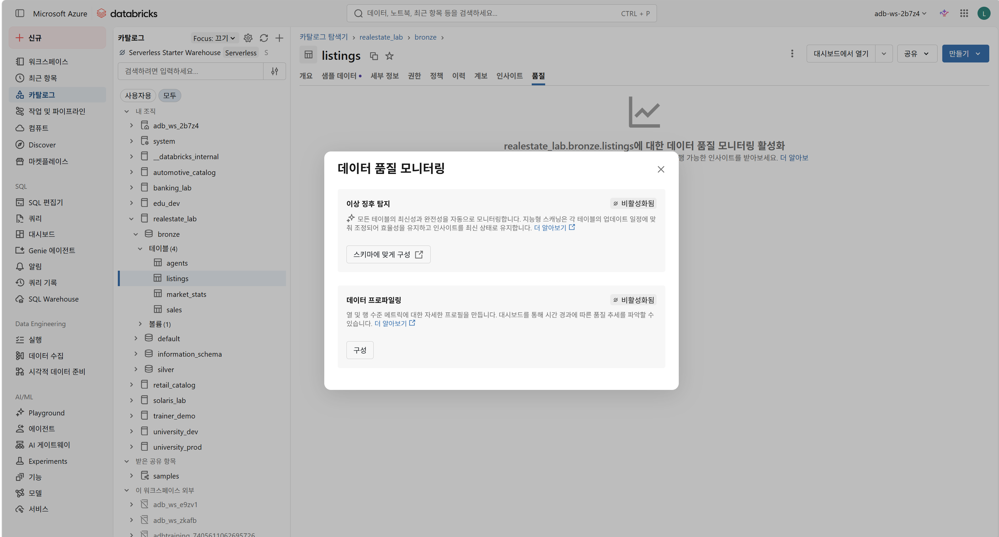
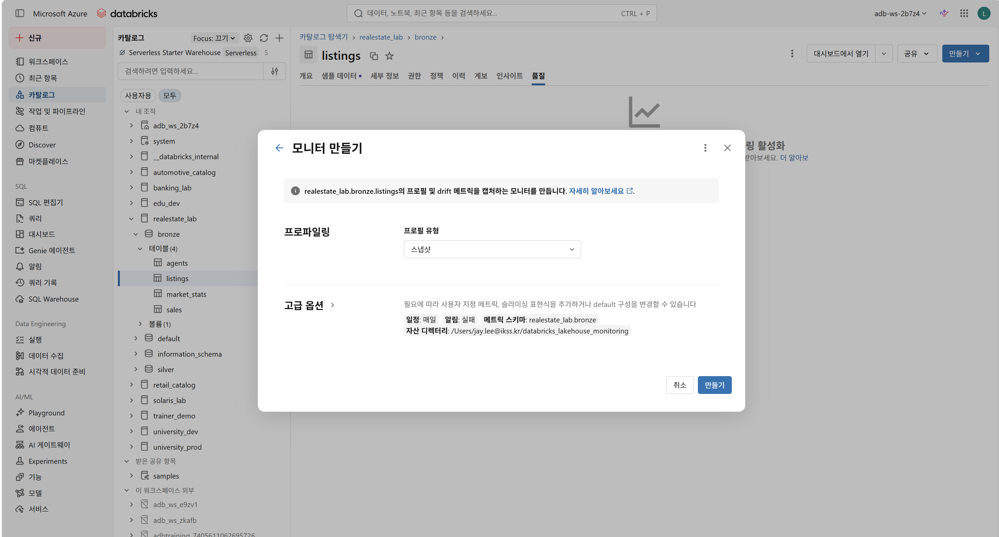

---
lab:
  index: 08
  title: Unity Catalog로 데이터 정제, 변환 및 로드
---

---
|구분|내용|
|---|---|
|설명| 이 랩에서는 Azure Databricks에서 원본 부동산 데이터를 정제하고 재구성합니다. 가격 및 타임스탬프에 적합한 데이터 유형을 선택하고, PySpark를 사용하여 중복 목록을 제거하고 누락된 값을 채우며, 내부 조인과 왼쪽 조인을 사용하여 테이블 전체의 데이터를 결합합니다. 또한 SQL PIVOT 및 UNPIVOT를 사용하여 추세 분석을 위해 시장 통계를 재구성합니다.|
|소요시간| 50분|
|난이도| 300|
---

# 랩 08: Unity Catalog로 데이터 정제, 변환 및 로드

## 소개

이 실습에서 여러분은 네덜란드의 주요 도시에서 활동하는 부동산 중개 업체인 Pristine Properties의 데이터 엔지니어 역할을 맡게 됩니다. 이 회사는 여러 중개 사무소와 위성 데이터베이스로부터 원시 부동산 매물 데이터를 수집했지만, 데이터 상태가 좋지 않습니다. 가격 정보의 정밀도가 떨어지고, 매물 데이터가 업데이트된 버전과 중복되어 있으며, 주요 필드에 Null 값이 포함되어 있고, 시장 통계 데이터는 추세 분석이 어려운 와이드 컬럼(wide-column) 형식으로 제공됩니다.

여러분의 임무는 가격 대시보드와 시장 분석 모델에 신뢰할 수 있는 데이터를 공급할 수 있도록 데이터를 정제하고, 데이터 유형을 확인하며, 데이터 형태를 재구성하는 것입니다.

다음과 같은 실습 과정을 진행합니다:

| 실습 | 주제 |
|---|---|
| 실습 1 | Pristine Properties 플랫폼 설정 |
| 실습 2 | 매물 데이터 프로파일링 |
| 실습 3 | 적절한 데이터 유형 선택 |
| 실습 4 | 중복 데이터 및 결측치 처리 |
| 실습 5 | 매물 데이터를 중개인 및 판매 데이터와 조인(Join)|
| 실습 6 | 시장 통계 데이터 피벗(Pivot) 및 언피벗(Unpivot) |

---

## 🤖 Genie Code — 항상 사용하세요

이 랩의 모든 실습 전체에서 **Genie Code를 사용할 것을 권장합니다**. 모든 노트북 셀에는 시작하기 위한 제안 프롬프트가 포함되어 있습니다. Genie Code는 귀사의 페어 프로그래머입니다 — 코드를 생성하고, 오류 메시지를 설명하고, 대안을 탐색하며, 접근 방식을 검증하는 데 사용하세요.

Genie Code를 열려면 모든 노트북 셀 오른쪽에 있는 을 선택하거나 키보드 단축키를 사용합니다.

---

## 필수 조건

- [랩 00: Azure Databricks 환경 설정](00-setup.md)을 사용하여 프로비저닝된 **Azure Databricks Premium 작업 영역**이 있습니다.
- 기본 SQL 및 Python/PySpark 개념에 익숙합니다.

---

## 노트북 가져오기

1. Databricks 작업 영역에서 왼쪽 사이드바의 **작업 영역** 을 클릭합니다.

2. 랩을 저장할 폴더로 이동하거나 생성합니다.

3. **⋮**(kebab) 메뉴를 클릭하거나 폴더를 마우스 오른쪽 단추로 클릭한 다음 **가져오기** 를 선택합니다.

4. **URL** 을 선택하고 다음 URL을 입력한 다음 **가져오기** 를 클릭합니다:

```
https://github.com/aiasdd/DP750/blob/main/Labs/Notebooks/08-cleanse-transform-load-data-into-unity-catalog-KO.ipynb
```

5. 가져온 노트북을 열고 위쪽의 컴퓨팅 선택기에서 **서버리스** 컴퓨팅을 선택합니다.

---

## 노트북 외 작업: 카탈로그 탐색기에서 데이터 프로필 생성

실습 1(환경 설정)을 완료한 후 카탈로그 탐색기 UI를 사용하여 **realestate_lab.bronze.listings** 테이블에 대한 데이터 프로필을 생성할 수 있습니다. 이것은 UI 기반 작업이며 코드가 필요하지 않습니다.

1. 왼쪽 탐색 창에서 **카탈로그 탐색기** 를 엽니다.
2. **realestate_lab** 카탈로그 → **bronze** 스키마 → **listings** 테이블로 이동합니다.
3. **품질** 탭을 선택합니다.
4. **활성화** 를 선택하여 데이터 품질 모니터링 대화 상자를 엽니다.
  
5. **데이터 프로파일링** 카드에서 **구성**을 선택하여 모니터 생성 대화 상자를 엽니다.
6. 프로필 유형으로 **스냅샷** 을 선택하세요 — 이는 `listings`와 같은 범용 테이블에 적합한 유형입니다.
7. **만들기** 를 선택하여 모니터를 생성하고 첫 번째 프로필을 만듭니다.
  
8. 프로필이 완료되면 생성된 메트릭을 살펴봅니다. 다음을 확인하세요:
    - **Null 개수(Null counts)** — 어떤 열에 결측값이 가장 많은가요?
    - **고유값 개수(Distinct counts)** — 예상치 못한 값이 포함된 열이 있나요?
    - **값 분포(Value distributions)** — `list_price` 값의 분포는 어떠한가요?

이 과정을 통해 프로그래밍 방식으로 데이터를 정제하기 전에 데이터에 대한 시각적 및 통계적 개요를 파악할 수 있습니다.
