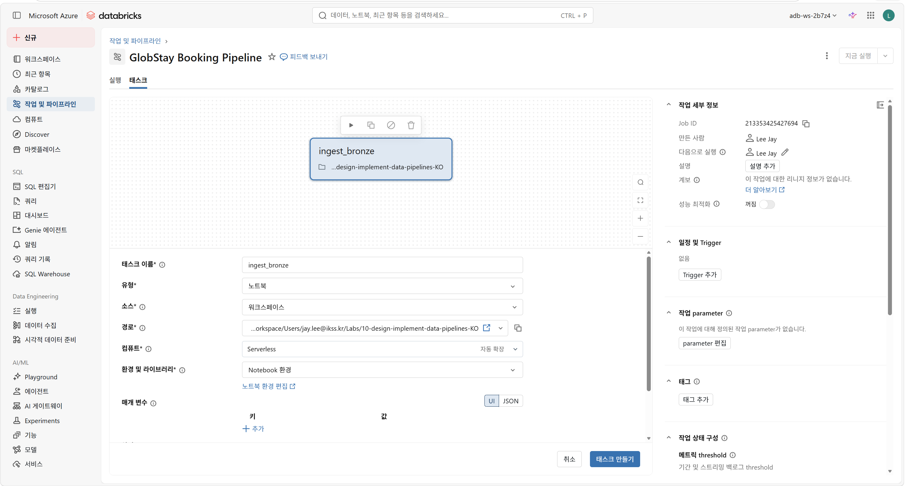
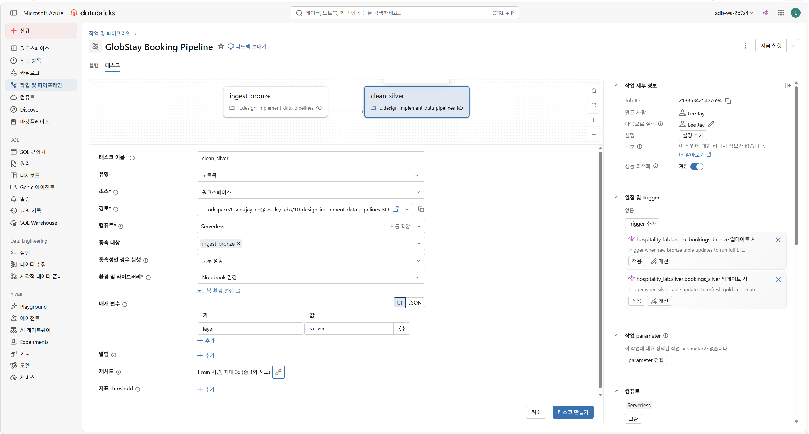
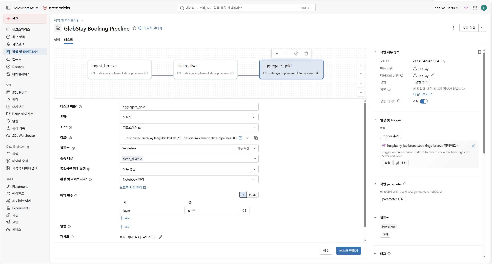
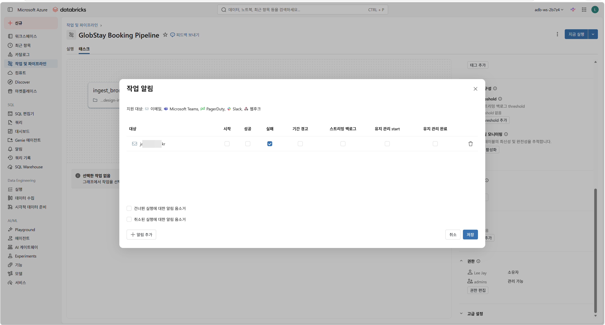
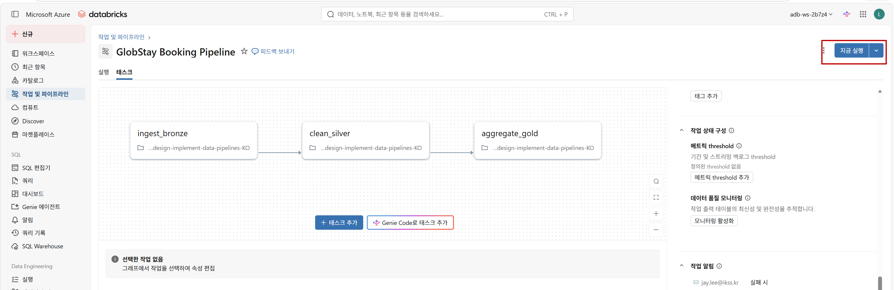
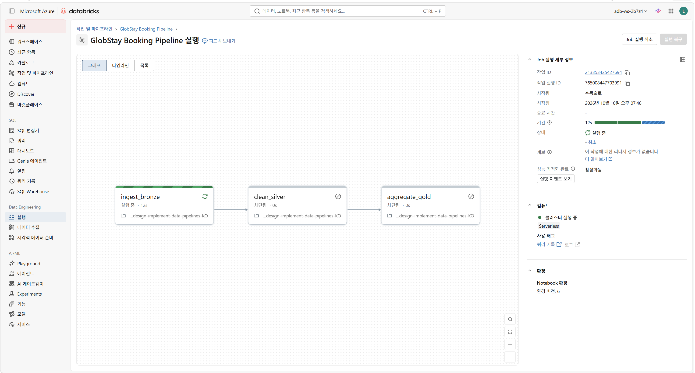
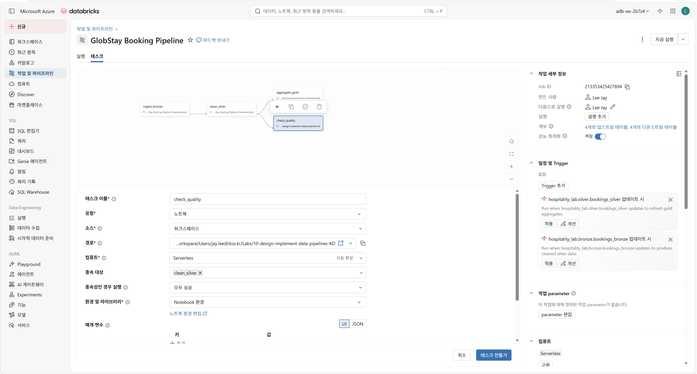
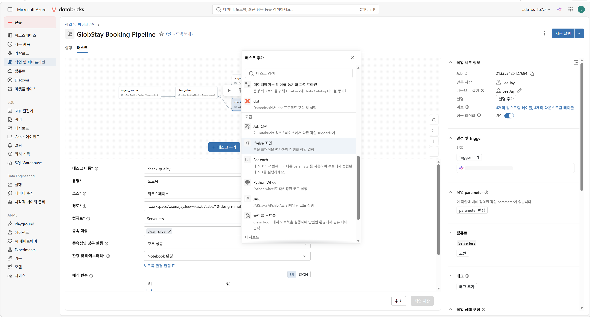
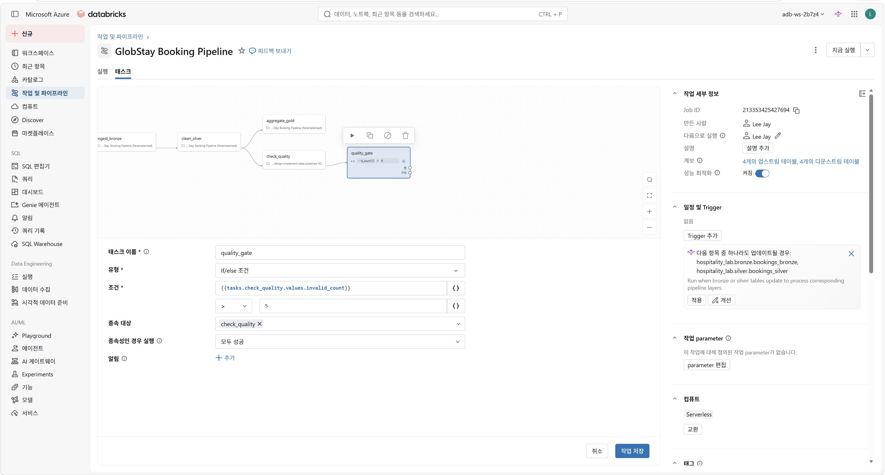

---
lab:
  index: 10
  title: Azure Databricks를 사용한 데이터 파이프라인 설계 및 구현
  module: Azure Databricks를 사용한 데이터 파이프라인 설계 및 구현
  module-url: https://learn.microsoft.com/training/wwl-databricks/design-implement-data-pipelines/
  notebook: https://github.com/aiasdd/DP750/blob/main/Labs/Notebooks/Allfiles/10-design-implement-data-pipelines-KO.ipynb
  description: 이 랩에서는 GlobStay 호텔 예약 데이터에 대해 메달리온 아키텍처 파이프라인(Bronze → Silver → Gold)을 구축하고, 중복 제거, 널 필터링 및 날짜 검증과 같은 정리 규칙을 적용한 후 속성 및 채널 성능에 대한 Gold 계층 집계를 생성합니다. 오류 처리를 구현하고 작업 오케스트레이션을 위해 노트북을 매개변수화합니다. 그런 다음 Azure Databricks UI에서 순차적 작업 종속성, 재시도 정책, 실패 알림 및 데이터 품질 라우팅을 위한 If/else 조건 작업을 사용하여 Lakeflow 작업을 구성합니다.
  duration: 50분
  level: 300
  islab: true
  primarytopics:
    - Azure Databricks
---

---
|구분|내용|
|---|---|
|설명| 이 랩에서는 GlobStay 호텔 예약 데이터에 대해 메달리온 아키텍처 파이프라인(Bronze → Silver → Gold)을 구축하고, 중복 제거, 널 필터링 및 날짜 검증과 같은 정리 규칙을 적용한 후 속성 및 채널 성능에 대한 Gold 계층 집계를 생성합니다. 오류 처리를 구현하고 작업 오케스트레이션을 위해 노트북을 매개변수화합니다. 그런 다음 Azure Databricks UI에서 순차적 작업 종속성, 재시도 정책, 실패 알림 및 데이터 품질 라우팅을 위한 If/else 조건 작업을 사용하여 Lakeflow 작업을 구성합니다.|
|소요시간| 50분|
|난이도| 300|
---

# 랩 10: Azure Databricks를 사용한 데이터 파이프라인 설계 및 구현

## 소개

여러분은 해변 리조트, 산악 로지, 도심 숙소, 공항 환승 호텔 등 5개 호텔 시설의 예약을 관리하는 호스피탈리티 그룹 GlobStay의 데이터 엔지니어입니다. GlobStay는 숙박 시설 관리 시스템(PMS)에서 원시 예약 데이터를 수집하고, 이를 정제 및 검증한 뒤 경영진을 위한 수익 분석 결과를 생성하는 야간 배치(batch) 파이프라인을 운영하고 있습니다.

이번 실습에서는 해당 파이프라인을 엔드투엔드로 설계하고 구현합니다. 구체적으로 다음 작업을 수행합니다:

- 호텔 예약 데이터에 대한 **메달리온 아키텍처**(Bronze → Silver → Gold)를 구축합니다
- Lakeflow 작업으로 오케스트레이션할 수 있는 **매개변수화되고 재사용 가능한 노트북 작업** 을 작성합니다
- **오류 처리** 를 추가하여 개별 작업이 정상적으로 실패하고 상태를 다운스트림 작업에 신호할 수 있도록 합니다
- 작업 종속성, 재시도 정책 및 알림이 있는 **Lakeflow 작업** 을 구성합니다
- 데이터 품질 결과를 기반으로 라우팅하기 위한 **조건부 작업 흐름**(If/else 분기)을 살펴봅니다

---

## 🤖 이 랩 전체에서 Genie Code를 사용합니다

모든 연습에 **Genie Code** 를 사용할 것을 권장합니다. 이를 사용하여 제안을 얻고, 오류를 설명하고, 상용구를 생성하고, API를 탐색합니다.

Genie Code를 열려면 모든 노트북 셀 오른쪽에 있는 을 선택하거나 키보드 단축키를 사용합니다.

> **예제 프롬프트:** *"booking_id 열에서 DataFrame를 중복 제거하고 rate_per_night이 0 이하인 행을 필터링하는 PySpark 명령문을 작성하도록 도와주세요."*

---

## 필수 조건

- [랩 00: Azure Databricks 환경 설정](00-setup.md)을 사용하여 프로비저닝된 **Azure Databricks Premium 워크스페이스**이 있습니다.
- Unity Catalog에서 카탈로그 및 스키마를 생성할 수 있는 권한이 있습니다.
- PySpark 및 Spark SQL에 대한 기본 이해가 있습니다.

---

## 파트 1: 노트북 연습(메달리온 아키텍처 + 오류 처리 + 매개변수)

### 노트북 가져오기

1. Databricks 워크스페이스에서 왼쪽 사이드바의 **워크스페이스** 을 클릭합니다.
2. 랩을 저장할 폴더로 이동하거나 생성합니다.
3. **⋮**(kebab 메뉴)를 클릭하거나 폴더를 마우스 오른쪽 단추로 클릭한 다음 **가져오기** 를 선택합니다.
4. **URL** 을 선택하고 다음 URL을 입력한 다음 **가져오기** 를 클릭합니다:

```
https://github.com/aiasdd/DP750/blob/main/Labs/Notebooks/10-design-implement-data-pipelines-KO.ipynb
```

5. 가져온 노트북을 열고 위쪽의 컴퓨팅 선택기에서 **서버리스** 컴퓨팅을 선택합니다.

### 노트북 연습 진행

노트북에는 5개의 연습이 포함되어 있습니다. 제공된 설정 셀을 실행한 다음 각 챌린지 셀을 완성합니다.

> **팁:** 챌린지 셀에는 주석으로 지침이 포함되어 있습니다. ✅로 표시된 셀은 이미 제공되었습니다 — 단순히 실행하면 됩니다.

---

## 파트 2: Lakeflow 작업으로 오케스트레이션(UI 연습)

이러한 연습은 Azure Databricks UI를 사용합니다. 이미 노트북 논리를 구축했으므로 — 이제 이러한 노트북을 프로덕션 등급 다중 작업 파이프라인으로 연결합니다.

> **참고:** 이 연습에서는 파트 1에서 가져온 노트북을 참조합니다. 실제 프로젝트에서는 각 계층에 대해 별도의 노트북을 생성합니다. 시연 목적으로 다른 매개변수로 동일한 노트북을 세 번 구성합니다.

### 연습: 다중 작업 파이프라인 작업 생성

1. 왼쪽 사이드바에서 **작업 및 파이프라인** 을 클릭합니다.
2. **작업 생성** 을 클릭합니다.
3. 위쪽에서 기본 작업 이름을 `GlobStay Booking Pipeline`으로 바꿉니다.

#### 작업 1 — Bronze 데이터 수집

4. **태스크** 편집기에서 **다른 태스크 유형 추가** 를 클릭하여 **노트북** 을 선택합니다.
5. **태스크 이름** 을 `ingest_bronze`로 입력합니다.
6. **소스** 드롭다운에서 **워크스페이스** 을 선택한 다음 가져온 노트북의 경로를 선택합니다.
7. **컴퓨팅** 필드에서 **서버리스** 를 선택합니다.
8. **태스크 만들기** 를 클릭합니다.


#### 작업 2 — Silver 데이터 정제

9. 작업 1 아래의 **+ 작업 추가** 를 클릭합니다(작업 1에 대한 종속성을 자동으로 설정).
10. 유형 **노트북**, 작업 이름 `clean_silver`, 동일한 노트북 경로, **서버리스** 컴퓨팅으로 지정합니다.
11. **매개변수** 아래에서 키에 `layer` 값 `silver`를 추가합니다.
12. **재시도** 아래에서 다음을 설정합니다:
    - **재시도 횟수:** `2`
    - **재시도 간격:** `60`초
13. **태스크 만들기** 를 클릭합니다.


#### 작업 3 — Gold 데이터 집계

14. 작업 2 아래의 **+ 작업 추가** 를 클릭합니다.
15. 유형 **노트북**, 작업 이름 `aggregate_gold`, 동일한 노트북 경로, **서버리스** 컴퓨팅으로 지정합니다.
16. **매개변수** 아래에서 키에 `layer`  값 `gold`를 추가합니다.
17. **태스크 만들기** 를 클릭합니다.


#### DAG 확인

18. DAG 보기를 검토합니다. 순차적으로 배열된 3개의 노드가 표시되어야 합니다:
    ```
    ingest_bronze → clean_silver → aggregate_gold
    ```
19. 작업 2와 작업 3이 각각 이전 작업에 "종속"임을 확인합니다.

#### 실패 알림 추가

20. 오른쪽 작업 상세 창에서 **작업 알림** 섹션에서 **알림 편집** 을 클릭합니다(알림 섹션으로 스크롤).
    
21. **알림 추가** 를 클릭합니다.
22. **실패 시** 를 선택하고 이메일 주소를 입력합니다.
23. 선택적으로 **음소거** 를 활성화하여 재시도 중 경고 피로를 방지합니다.
24. **저장** 을 클릭합니다.
    

#### 작업 실행

25. **지금 실행**(오른쪽 위)을 클릭합니다.
    
26. **실행** 탭에서 각 작업이 순차적으로 실행되는 것을 확인합니다.
    
27. 실행 타임라인의 작업을 클릭하여 출력, 로그 및 지속 시간을 확인합니다.

---

### 연습: 데이터 품질 라우팅을 위한 조건부 작업 흐름 추가

실제 파이프라인에서는 데이터 품질 문제가 감지되었는지 여부에 따라 실행을 다르게 라우팅하려고 할 수 있습니다. 이 연습은 가상 데이터 품질 임계값을 기반으로 분기하는 **If/else 조건** 작업을 추가합니다.

1. **GlobStay Booking Pipeline** 작업 편집기로 돌아갑니다.
2. **+ 태스크 추가** 를 클릭합니다(종속성을 피하기 위해 먼저 작업 3의 선택을 해제).
3. 유형 **노트북**, 태스크 이름 `check_quality`, 동일한 노트북 경로로 지정합니다.
4. 이 작업을 **clean_silver**에 종속되도록 설정합니다. 태스크를 만듭니다.

5. **+ 작업 추가** 를 클릭합니다.
6. **유형** 드롭다운에서 **If/else 조건** 을 선택합니다.
    
7. 태스크 이름을 `quality_gate`로 지정합니다.
8. 이 작업을 **check_quality**에 종속되도록 설정합니다.
9. **조건** 필드에 다음을 입력합니다:
 | 필드 | 값 |
 |---|---|
 | `Condition` | `{{tasks.check_quality.values.invalid_count}}` |
 | `Operator` | `>` |
 | `Value` | `5` |

    
10. **참이면** 경로의 경우 `alert_data_issues`(노트북, 동일한 경로)라는 작업을 추가합니다.
11. **거짓이면** 경로의 경우 `proceed_gold`(노트북, 동일한 경로)라는 작업을 추가합니다.

> **토론:** 이는 try/except를 사용하여 노트북 자체 내에서 오류 처리를 구현하는 것과 어떻게 비교됩니까? 각 접근 방식을 언제 선택하시겠습니까?

---

## 요약

이 랩에서 귀사는:

- Unity Catalog에서 호텔 예약 데이터에 대한 **메달리온 아키텍처**(Bronze → Silver → Gold)를 구축했습니다
- **데이터 정제 패턴**(중복 제거, Null 필터링, 날짜 유효성 검사 및 값 제약 조건)을 적용했습니다
- **Gold 계층 집계**(부동산 수익 및 예약 채널 성과 포함)를 생성했습니다
- try/except 및 dbutils.notebook.exit()을 사용하여 작업 수준 신호에 대한 **오류 처리** 를 구현했습니다
- **dbutils.widgets** 를 사용하여 노트북을 매개변수화하고 **dbutils.jobs.taskValues** 를 사용하여 작업 간 값을 전달했습니다
- 순차적 작업 종속성, 재시도 정책, 알림 및 If/else 조건 작업이 있는 **Lakeflow 작업** 을 구성했습니다
